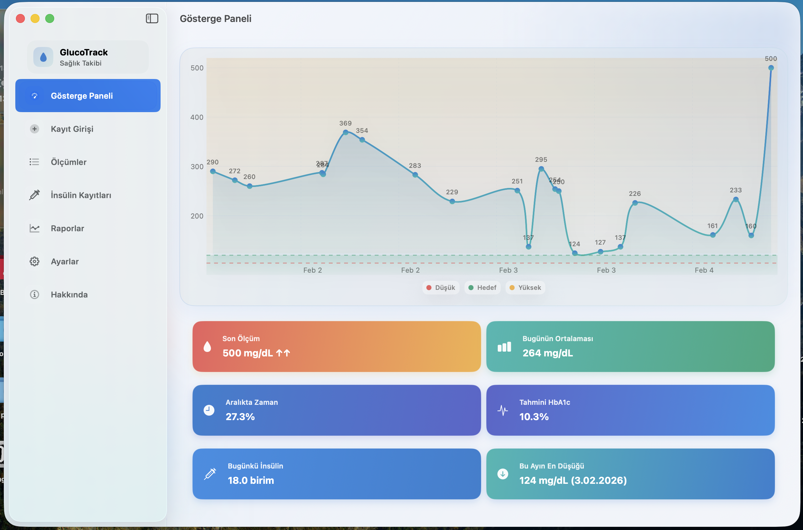
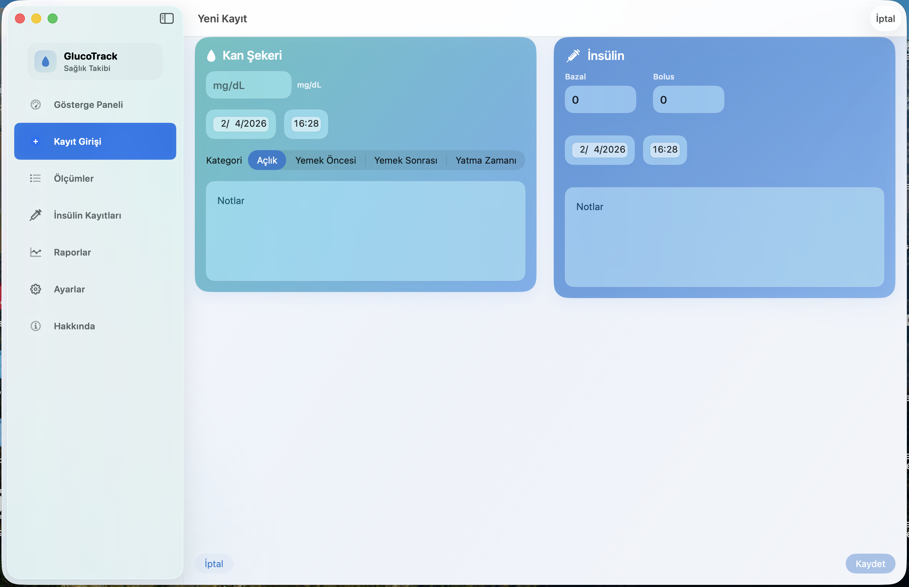
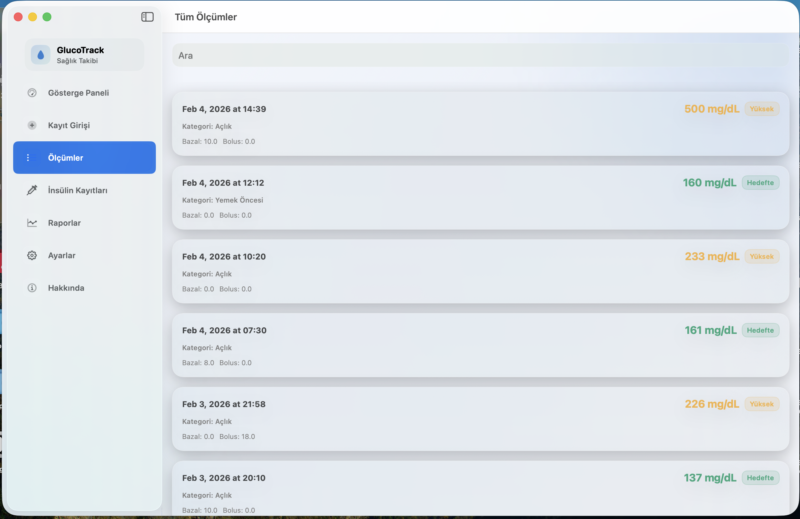
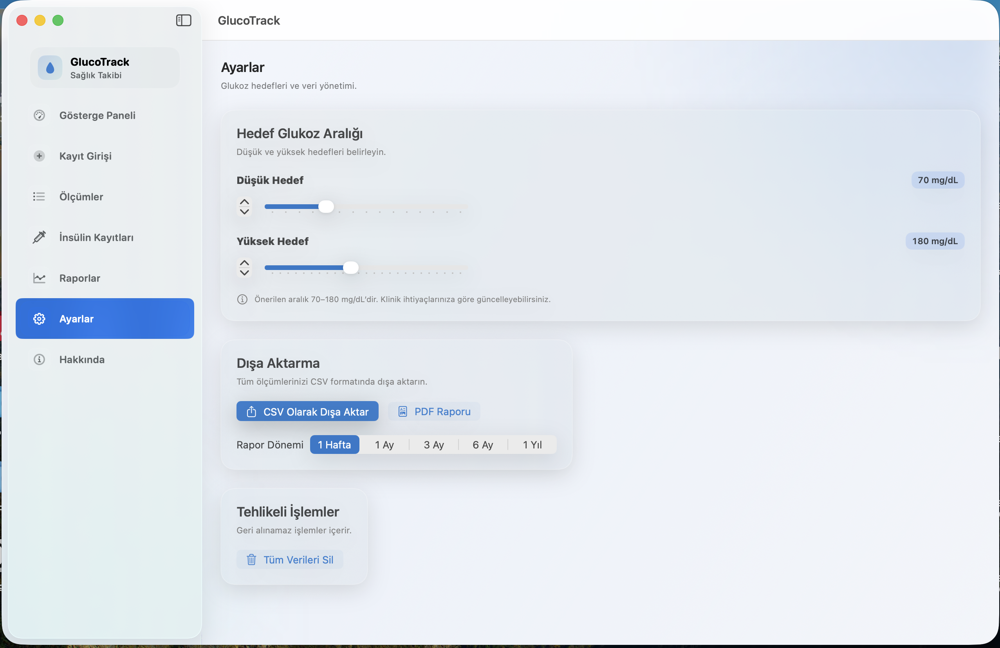

# GlukozTakip

A native macOS app developed with **SwiftUI** and **CoreData** to track blood glucose and insulin levels.
## 📸 Screenshots

### Main Screen

### Add Entry

### List

### Reports

### Settings
## 🛠 Features
- Record glucose measurements
- Log insulin doses
- View history with intuitive UI
- Native macOS experience

## 📦 Tech Stack
- Swift
- SwiftUI
- CoreData
- macOS (AppKit integration optional)

## 📄 License
MIT License
